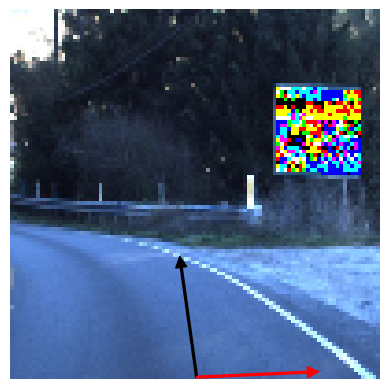

#Property 0
##Status: OSError: [Errno 28] No space left on device
###Time: 1800
#Property 1
##Status: sat
###Time: 1358.5010

#Property 2
##Status: timeout
###Time: 1800
#Property 3
##Status: timeout
###Time: 1800
#Property 4
##Status: timeout
###Time: 1800
#Property 5
##Status: timeout
###Time: 1800
#Property 6
##Status: timeout
###Time: 1800
#Property 7
##Status: timeout
###Time: 1800
#Property 8
##Status: timeout
###Time: 1800
#Property 9
##Status: timeout
###Time: 1800
